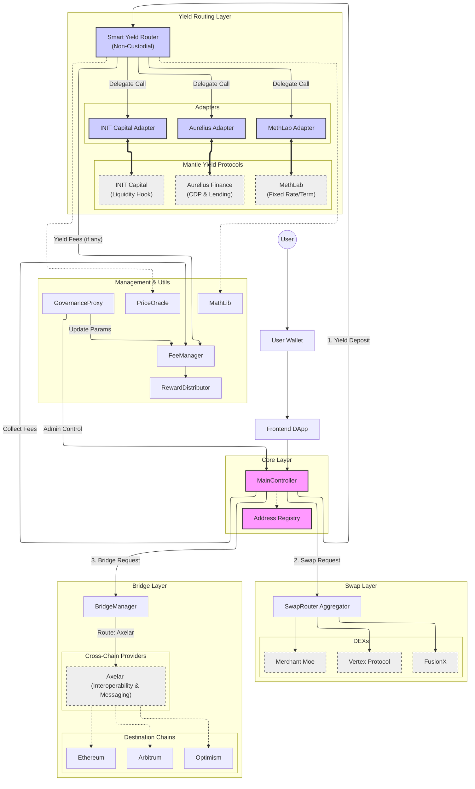

# Dokumentasi Arsitektur Smart Contract: Multi-Protocol DeFi App (Mantle Ecosystem)

Dokumen ini menjelaskan desain teknis untuk aplikasi DeFi yang mengintegrasikan fitur Yield Routing (Smart Router), Swapping, dan Bridging dalam satu ekosistem terpadu, dikhususkan untuk ekosistem **Mantle Network**.

## Diagram Arsitektur Sistem

Berikut adalah diagram arsitektur yang menggambarkan hubungan antar komponen dengan protokol-protokol spesifik di Mantle. Diagram ini menggunakan konsep **Smart Router** untuk fleksibilitas maksimal user.



---

## Detail Komponen (Mantle Ecosystem)

### A. Main Contract (Controller)

- **Peran:** Sentral otorisasi dan orkestrasi (Facade).
- **Fungsi Detail:**
  - `depositToYield(token, amount, protocol)`: Mengarahkan user ke Smart Router untuk deposit ke protokol pilihan.
  - `executeSwap(tokenIn, tokenOut, amount, route)`: Memanggil SwapRouter untuk eksekusi trade.
  - `bridgeAsset(token, amount, destChain, bridgeProvider)`: Menginisiasi transaksi cross-chain via BridgeManager.
  - **Keamanan:** Menerapkan `nonReentrant` dan `onlyOwner`/`onlyGovernance` untuk fungsi administratif.

### B. Yield Routing Layer (Smart Router)

Layer ini menggantikan konsep "Vault" tradisional. Dana tidak disimpan di kontrak ini, melainkan langsung diteruskan ke protokol tujuan (Non-Custodial).

- **Smart Yield Router:**
  - **Fungsi:** Menerima aset dari user, memanggil adapter yang sesuai, dan mengirimkan bukti deposit (aToken/cToken) kembali ke user.
  - **Direct Ownership:** User memegang kendali penuh atas aset mereka di protokol lending.
  - **Fleksibilitas:** User bisa memilih protokol mana (INIT, MethLab, Aurelius) yang ingin digunakan.

**Adapter Protokol (Mantle Top 3):**

1.  **INIT Capital Adapter:**
    - _Protokol:_ **INIT Capital** (Liquidity Hook Money Market).
    - _Integrasi:_ `deposit()` memanggil `InitCore.supply()`, `withdraw()` memanggil `InitCore.withdraw()`.
2.  **MethLab Adapter:**
    - _Protokol:_ **MethLab** (Liquidation-free, Oracle-less Lending).
    - _Integrasi:_ Adapter mengelola interaksi dengan pasar Fixed Rate/Fixed Term.
3.  **Aurelius Adapter:**
    - _Protokol:_ **Aurelius Finance** (CDP & Lending).
    - _Integrasi:_ Supply collateral untuk minting stablecoin atau lending pool.

### C. Swap/DEX Layer (Mantle Top 3)

Layer ini menangani pertukaran aset dengan likuiditas terdalam di Mantle.

1.  **Merchant Moe Adapter:**
    - _Protokol:_ **Merchant Moe** (DEX Utama Mantle).
    - _Teknis:_ Menggunakan Router V2/V3 standard.
    - _Keunggulan:_ Likuiditas terdalam untuk pair native Mantle (MNT, mETH). Adapter akan mencari jalur dengan slippage terendah.
2.  **Vertex Adapter:**
    - _Protokol:_ **Vertex Protocol**.
    - _Teknis:_ Interaksi dengan on-chain clearinghouse atau smart contract Vertex.
    - _Keunggulan:_ Eksekusi ultra-cepat dan efisien modal (cross-margin). Cocok untuk swap size besar atau hedging strategi.
3.  **FusionX Adapter:**
    - _Protokol:_ **FusionX**.
    - _Teknis:_ V3 Concentrated Liquidity AMM.
    - _Keunggulan:_ Efisiensi modal tinggi untuk stable pair (misal USDC/USDT) atau correlated assets (ETH/mETH).

### D. Bridge Layer (Axelar-first & Extensible)

Layer ini menghubungkan aplikasi dengan chain lain (Omnichain). Untuk saat ini hanya **Axelar** yang aktif karena token lintas-chain yang tersedia baru mendukung standar Axelar. Struktur kontrak tetap modular sehingga Stargate atau LayerZero dapat diaktifkan kembali cukup dengan menambahkan router/adapter baru.

- **Axelar Adapter (aktif):**
  - _Teknologi:_ Gateway Contract & Axelar Network (Cosmos SDK chain).
  - _Flow:_ Memanggil `transferRemote` pada token bergaya Axelar. Validator Axelar memverifikasi dan merelay pesan ke chain tujuan.
  - _Keunggulan:_ General Message Passing (GMP) yang kuat sehingga bisa menjalankan call lintas chain dalam satu transaksi user.
- **Penyedia lain (dinonaktifkan sementara):**
  - Kerangka router/adapter tetap ada melalui `BaseBridgeRouter` dan `BaseBridgeAdapter`.
  - Saat token/protokol baru siap, cukup menambahkan turunan baru dan mendaftarkannya di registry/FE tanpa mengubah arsitektur inti.

---

## 📋 PART 1: PROJECT STRUCTURE (Foundry)

Berikut adalah struktur proyek yang disesuaikan dengan konsep **Smart Router**.

```text
textdefi-aggregator/
├── src/                                # Source contracts
│   ├── core/
│   │   ├── MainController.sol          # Main entry point (Facade)
│   │   ├── AdapterRegistry.sol         # Adapter management
│   │   └── AccessControl.sol           # RBAC
│   │
│   ├── yield/                          # Yield Routing Layer
│   │   ├── SmartYieldRouter.sol        # Router Logic (Non-Custodial)
│   │   ├── adapters/
│   │   │   ├── InitCapitalAdapter.sol
│   │   │   ├── MethLabAdapter.sol
│   │   │   ├── AureliusAdapter.sol
│   │   │   └── BaseAdapter.sol         # Abstract base adapter
│   │   └── IYieldAdapter.sol
│   │
│   ├── swap/                           # Swap orchestration
│   │   ├── SwapAggregator.sol
│   │   ├── adapters/
│   │   │   ├── FusionXAdapter.sol
│   │   │   ├── MerchantMoeAdapter.sol
│   │   │   ├── VertexAdapter.sol
│   │   ├── interfaces/
│   │   │   └── ISwapAdapter.sol
│   │   │   └── ISwapAggregator.sol
│   │   │   └── ISwapRouter.sol
│   │   └── routers/
│   │       ├── FusionXRouter.sol
│   │       ├── MerchantMoeRouter.sol
│   │       └── VertexRouter.sol
│   │
│   ├── token/                          # Stablecoin tokens
│   │   ├── MockIDRX.sol
│   │   └── MockUSDT.sol
│   │
│   ├── bridge/
│   │   ├── BridgeLayer.sol             # Bridge orchestration
│   │   ├── adapters/
│   │   │   ├── AxelarBridgeAdapter.sol
│   │   └── IBridgeAdapter.sol
│   │
│   └── interfaces/                     # Shared interfaces
│       ├── IERC20.sol
│       └── IAggregator.sol
│
├── test/                               # Tests
│   ├── unit/
│   │   ├── Router.t.sol                # Test Smart Router
│   │   ├── Swap.t.sol
│   │   └── Bridge.t.sol
│   │
│   └── integration/
│       ├── RouterSwap.t.sol
│       └── FullFlow.t.sol
│
├── script/                             # Deployment scripts
│   ├── Deploy.s.sol
│   ├── RegisterAdapters.s.sol
│   └── Verify.s.sol
│
├── lib/                                # Dependencies
├── foundry.toml                        # Foundry configuration
├── .env.example
├── Makefile
└── README.md
```

