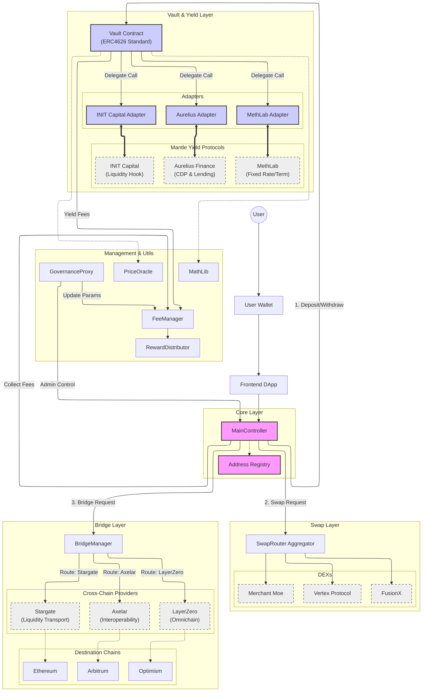

# Dokumentasi Arsitektur Smart Contract: Multi-Protocol DeFi App (Mantle Ecosystem)

Dokumen ini menjelaskan desain teknis untuk aplikasi DeFi yang mengintegrasikan fitur Lending (Multi-Protocol), Swapping, dan Bridging dalam satu ekosistem terpadu, dikhususkan untuk ekosistem **Mantle Network**.

## Diagram Arsitektur Sistem

Berikut adalah diagram arsitektur yang menggambarkan hubungan antar komponen dengan protokol-protokol spesifik di Mantle. Diagram ini telah diperbarui untuk memastikan kompatibilitas syntax dan kejelasan alur.



---

## Detail Komponen (Mantle Ecosystem)

### A. Main Contract (Controller)
*   **Peran:** Sentral otorisasi dan orkestrasi.
*   **Fungsi Detail:**
    *   `depositToVault(token, amount, strategy)`: Memverifikasi input, menarik token dari user, dan meneruskannya ke Vault yang sesuai.
    *   `executeSwap(tokenIn, tokenOut, amount, route)`: Memanggil SwapRouter untuk eksekusi trade.
    *   `bridgeAsset(token, amount, destChain, bridgeProvider)`: Menginisiasi transaksi cross-chain via BridgeManager.
    *   **Keamanan:** Menerapkan `nonReentrant` dan `onlyOwner`/`onlyGovernance` untuk fungsi administratif.

### B. Vault & Yield Layer (Mantle Top 3)
Layer ini mengelola aset user dan mendistribusikannya ke protokol yield terbaik di Mantle menggunakan standar **ERC-4626**.

1.  **INIT Capital Adapter:**
    *   *Protokol:* **INIT Capital** (Liquidity Hook Money Market).
    *   *Mekanisme:* Adapter berinteraksi dengan `InitCore` contract.
    *   *Strategi:* Menggunakan "Liquidity Hooks" untuk meminjamkan aset (Lending) atau melakukan strategi looping (Leveraged Yield) jika diizinkan oleh risk manager.
    *   *Integrasi:* `deposit()` memanggil `InitCore.supply()`, `withdraw()` memanggil `InitCore.withdraw()`.
2.  **MethLab Adapter:**
    *   *Protokol:* **MethLab** (Liquidation-free, Oracle-less Lending).
    *   *Mekanisme:* Berinteraksi dengan pasar Fixed Rate/Fixed Term.
    *   *Strategi:* Mengunci aset untuk periode tertentu (term) untuk mendapatkan yield tetap yang lebih tinggi, menghilangkan risiko fluktuasi suku bunga.
    *   *Integrasi:* Adapter mengelola NFT posisi (jika ada) atau pembukuan internal untuk jatuh tempo (maturity date).
3.  **Aurelius Adapter:**
    *   *Protokol:* **Aurelius Finance** (CDP & Lending).
    *   *Mekanisme:* Minting stablecoin (misal: aUSD) dengan kolateral aset user atau lending langsung ke pool.
    *   *Strategi:* Memaksimalkan efisiensi modal dengan menjadikan aset user sebagai kolateral untuk minting stablecoin yang kemudian di-farm kembali (Looping), atau supply ke lending pool konvensional.

### C. Swap/DEX Layer (Mantle Top 3)
Layer ini menangani pertukaran aset dengan likuiditas terdalam di Mantle.

1.  **Merchant Moe Adapter:**
    *   *Protokol:* **Merchant Moe** (DEX Utama Mantle).
    *   *Teknis:* Menggunakan Router V2/V3 standard.
    *   *Keunggulan:* Likuiditas terdalam untuk pair native Mantle (MNT, mETH). Adapter akan mencari jalur dengan slippage terendah.
2.  **Vertex Adapter:**
    *   *Protokol:* **Vertex Protocol**.
    *   *Teknis:* Interaksi dengan on-chain clearinghouse atau smart contract Vertex.
    *   *Keunggulan:* Eksekusi ultra-cepat dan efisien modal (cross-margin). Cocok untuk swap size besar atau hedging strategi.
3.  **FusionX Adapter:**
    *   *Protokol:* **FusionX**.
    *   *Teknis:* V3 Concentrated Liquidity AMM.
    *   *Keunggulan:* Efisiensi modal tinggi untuk stable pair (misal USDC/USDT) atau correlated assets (ETH/mETH).

### D. Bridge Layer (Top 3 Interoperability)
Layer ini menghubungkan aplikasi dengan chain lain (Omnichain).

1.  **Stargate Adapter:**
    *   *Protokol:* **Stargate**.
    *   *Teknologi:* LayerZero messaging + Unified Liquidity Pools.
    *   *Flow:* User deposit di Chain A -> Stargate lock -> Pesan via LayerZero -> Stargate Chain B release aset native.
    *   *Keunggulan:* Instant finality (probabilistik) dan menerima aset native (bukan wrapped token).
2.  **Axelar Adapter:**
    *   *Protokol:* **Axelar**.
    *   *Teknologi:* Gateway Contract & Axelar Network (Cosmos SDK chain).
    *   *Flow:* Memanggil `callContractWithToken` pada Axelar Gateway. Validator Axelar memverifikasi dan merelay pesan ke chain tujuan.
    *   *Keunggulan:* General Message Passing (GMP) yang sangat kuat, bisa memanggil fungsi smart contract di chain tujuan (misal: Deposit ke Vault di chain lain dalam 1 klik).
3.  **LayerZero Adapter:**
    *   *Protokol:* **LayerZero**.
    *   *Teknologi:* Ultra Light Nodes (ULN) & Relayers.
    *   *Flow:* Mengirim payload pesan via `endpoint.send()`. Aplikasi mendefinisikan logic eksekusi di sisi penerima (`lzReceive`).
    *   *Keunggulan:* Standar industri untuk interoperabilitas, sangat fleksibel untuk membangun OFT (Omnichain Fungible Token).

---

## 📋 PART 1: PROJECT STRUCTURE (Foundry)

Berikut adalah struktur proyek yang disesuaikan dengan framework **Foundry** (Solidity-centric).

```text
textdefi-aggregator/
├── src/                                # Source contracts (pengganti 'contracts/')
│   ├── core/
│   │   ├── MainController.sol          # Main entry point
│   │   ├── AdapterRegistry.sol         # Adapter management
│   │   └── AccessControl.sol           # RBAC
│   │
│   ├── bridge/
│   │   ├── BridgeLayer.sol             # Bridge orchestration
│   │   ├── adapters/
│   │   │   ├── StargateBridgeAdapter.sol
│   │   │   ├── AxelarBridgeAdapter.sol
│   │   │   ├── LayerZeroBridgeAdapter.sol
│   │   │   └── IBridgeAdapter.sol
│   │
│   ├── swap/
│   │   ├── SwapLayer.sol               # Swap orchestration
│   │   ├── adapters/
│   │   │   ├── MerchantMoeAdapter.sol
│   │   │   ├── VertexAdapter.sol
│   │   │   ├── FusionXAdapter.sol
│   │   │   └── ISwapAdapter.sol
│   │
│   ├── yield/
│   │   ├── YieldLayer.sol              # Yield orchestration
│   │   ├── adapters/
│   │   │   ├── InitCapitalAdapter.sol
│   │   │   ├── MethLabAdapter.sol
│   │   │   ├── AureliusAdapter.sol
│   │   │   ├── BaseAdapter.sol         # Abstract base adapter
│   │   │   └── IYieldAdapter.sol
│   │   └── vaults/
│   │       ├── BaseVault.sol
│   │       ├── USDCVault.sol
│   │       ├── ETHVault.sol
│   │       └── MixedVault.sol
│   │
│   └── interfaces/                     # Shared interfaces
│       ├── IERC20.sol
│       └── IAggregator.sol
│
├── test/                               # Tests (Foundry uses .t.sol)
│   ├── unit/
│   │   ├── Bridge.t.sol
│   │   ├── Swap.t.sol
│   │   └── Yield.t.sol
│   │
│   └── integration/
│       ├── BridgeSwap.t.sol
│       ├── SwapYield.t.sol
│       └── FullFlow.t.sol
│
├── script/                             # Deployment scripts (Foundry uses .s.sol)
│   ├── Deploy.s.sol
│   ├── RegisterAdapters.s.sol
│   └── Verify.s.sol
│
├── lib/                                # Dependencies (OpenZeppelin, forge-std, etc.)
├── foundry.toml                        # Foundry configuration
├── .env.example
└── README.md
```
